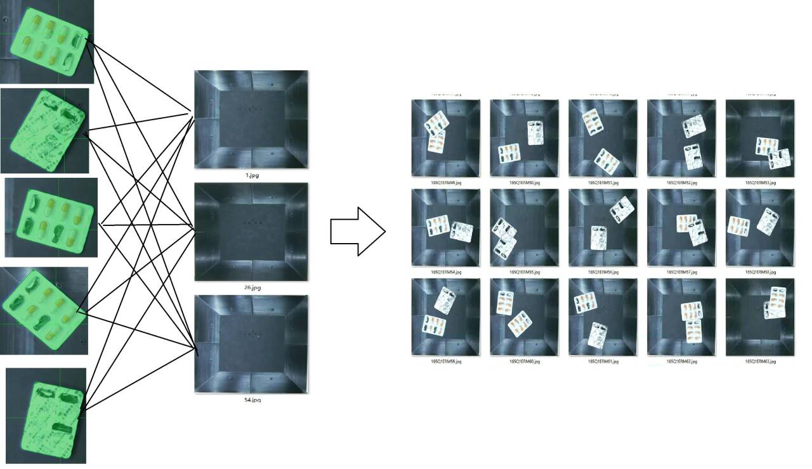
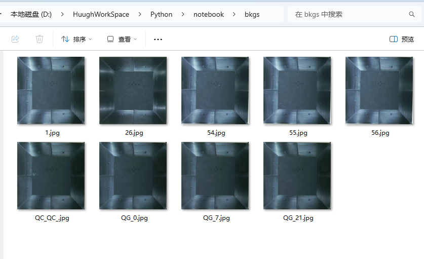
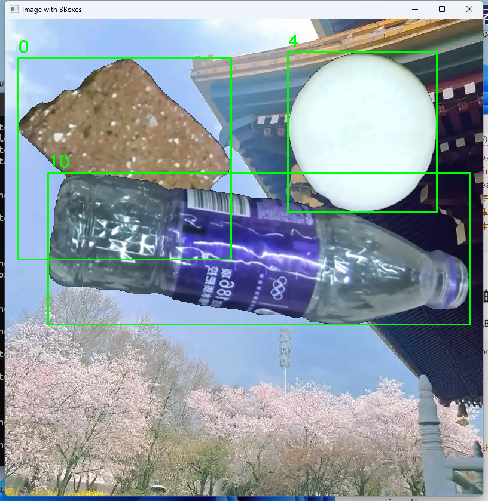
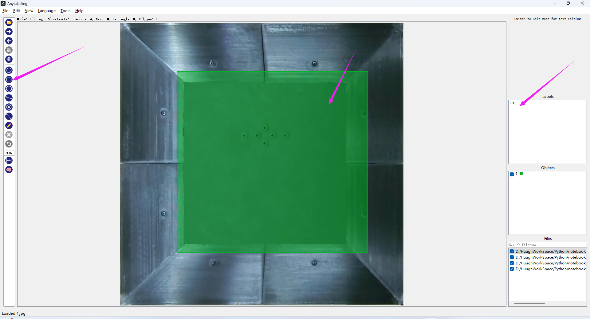
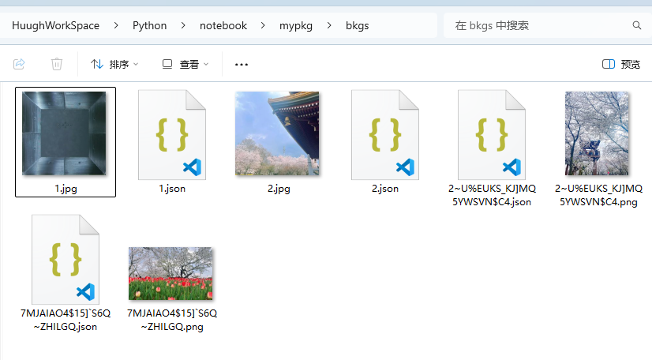

# Seg2DetAugment
<div align="center">

 [](https://pypi.org/project/Seg2DetAugment/) [](https://opensource.org/licenses/MIT) [](https://github.com/Huuuuugh/Seg2DetAugment/actions)

[中文](https://github.com/Huuuuugh/Seg2DetAugment/blob/main/README_CN.md) ｜  English 


</div>

### Overview

Seg2DetAugment is a Python package used for converting semantic segmentation data into object detection data and providing advanced data augmentation functions. Through operations such as rotation and background replacement, this tool generates a detection dataset with rotational invariance and adaptability to complex backgrounds, effectively enhancing the robustness of the model in complex scenarios.

When performing object detection tasks, the background often affects the accuracy of our recognition. For example, the model sometimes misidentifies the background as an object, or makes recognition errors when two objects partially occlude each other. Moreover, **convolutional neural networks have limitations in rotational adaptability and lack an explicit rotational invariance mechanism**. That is to say, when objects are placed in a rotated position, they usually become difficult to recognize, and the confidence level is low, etc. If you have tried the rotation augmentation methods available on the market, you will find that they all have the bug that the bounding box (bbox) inexplicably becomes larger. This is inevitable. Only when the contour of the object is known can rotation ensure that the bbox remains the circumscribed rectangle. Therefore, it is necessary to propose a dataset augmentation method to provide the model with the performance of an object under different backgrounds and the state of the object at different rotation angles.

### Core Advantages

1. **Enhanced Rotational Invariance**: Maintains the accuracy of the bounding box after rotation through contour tracing technology.
2. **Adaptability to Complex Backgrounds**: Supports dynamic background replacement and the superposition of multiple objects.
3. **Improved Annotation Efficiency**: Only a small amount of semantic segmentation annotation is required to generate a large-scale detection dataset.

### Typical Application Scenarios

- Multi-angle object detection in industrial quality inspection.
- Adaptation to complex backgrounds in the scenario of garbage classification.
- Recognition of multi-pose targets in remote sensing images.

### Installation Method

```bash
pip install Seg2DetAugment
```

## Making Dataset

Install Anylabeling.

```
conda create -n anylabeling python=3.10 anaconda
conda activate anylabeling
```

CPU：

```
pip install anylabeling
```

GPU:

```
pip install anylabeling-gpu
```

After the installation is completed, run it using the command.

```
anylabeling
```

When you need to execute it next time, you just need to do this.

```
conda activate anylabeling
anylabeling
```

Prepare the folder containing the images you want to annotate, and click here to select your image folder.


Then click on this icon of the brain to start the SAM (Segment Anything Model) annotation.


Select a model you want. The model will be automatically downloaded from the internet.


Then click the "+Point" button and just click on the object.


If the calculated boundary curve meets your requirements, click "finish". If there are any issues, you can click on the wrongly marked area with the "-Point" button, and it will automatically recalculate.

Enter the name you want. The names for the same object must be identical.


After completing all the markings, all your labels and images will be saved in the same folder, just like this.


Then, prepare several blank background images like I do. Please try to create some differences among these background images as much as possible.



### Quick Start

```python
from Seg2DetAugment import data_augmentation

# Define the category mapping
dics = {
    'battery': 0,
    'bottle': 1,
    # ... Other categories
}

# Run data augmentation
data_augmentation(
    dics=dics,
    output_folder="output",
    path2labels="path/to/labels",
    path2imgs="path/to/images",
    path2bkgs="path/to/backgrounds",
    counts=3,        # Number of objects per image
    threshold=0.5,   # Overlap threshold
    num_images=100   # Total number of generated images
)
```

The results after visualizing the labels and images:



### You can also augment the data with key points.

After annotating the key points in JSON format using LabelMe,

```python
from Seg2DetAugment import data_augmentation

# Define the class mapping
dics = {
    'ruler': 0,
}

pointOrder=["acute_angle","right_angle"] # The order of the key points

# Run data augmentation
data_augmentation(
    dics=dics,
    output_folder="output",
    path2labels="path/to/labels",
    path2imgs="path/to/images",
    path2bkgs="path/to/backgrounds",
    counts=3,        # The number of objects per image
    threshold=0.5,   # Overlap threshold
    num_images=100,   # The total number of generated images
    pointOrder=pointOrder # Array of the order of key points
)
```

The augmentation effect is as follows


### *If you want to generate within the specified background area

Outline the area in the background image like this.



file structure



It will only be generated within the selected area.

When `forceScale` is set to False, the size of the object will not be scaled proportionally according to the selected area. However, please note that this may lead to an error. When the object itself is larger than the background area you selected, it will cause an error because the object cannot fit into the background.

When `forceScale` is set to True, the object will be automatically scaled according to the range of the newly selected frame background. The object will become smaller, and there will be no error.

### Output Structure

```plaintext
output/
├── label/
│   ├── 0.txt
│   └── ...
└── img/
    ├── 0.jpg
    └── ...
```

### Parameter Explanation

| Parameter Name         | Description                                                  | Default Value |
| ---------------------- | ------------------------------------------------------------ | ------------- |
| `dics`                 | Mapping of category labels                                   | Required      |
| `output_folder`        | Path of the output directory                                 | Required      |
| `path2labels`          | Path of the input segmentation labels                        | Required      |
| `path2imgs`            | Path of the input original images                            | Required      |
| `path2bkgs`            | Path of the background images                                | Required      |
| `counts`               | Maximum number of objects in a single image                  | 3             |
| `threshold`            | Overlap detection threshold (IOU)                            | 0.5           |
| `num_images`           | Total number of generated images                             | 100           |
| `pointOrder` *keypoint | Array of the order of key points                             | []            |
| `forceScale`           | Force the object to scale proportionally to match the range of the box-selected background. | True          |

### Detailed Explanation of `threshold`

The following is an example to explain the function of `threshold`.


As shown in the figure, there is actually a strip of radish inside the purple box, but it is completely (100%) occluded by a mineral water bottle and a Fanta bottle. If this dataset is used for training an object detection model, the consequences will be disastrous. Therefore, the function of the `threshold` is to ensure that at least 50% of the area of each object is visible. That is to say, occlusion is allowed, but the maximum occlusion rate is 50%, not 100%.

Set `threshold` to the occlusion rate you want. For example, when `threshold = 0.5`, the generated result will be much more satisfactory.


### Licence

This project is open source under the MIT License.
