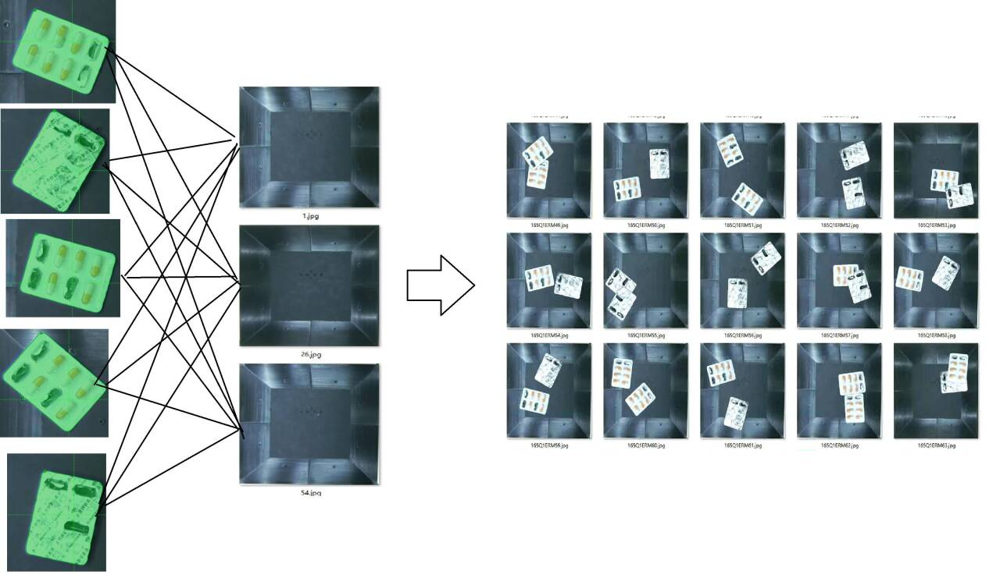
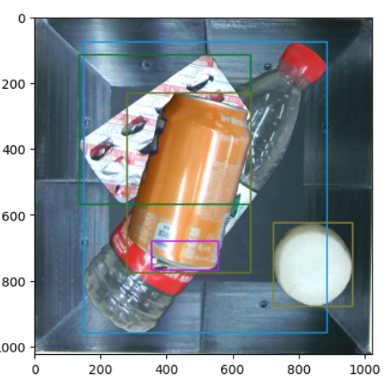
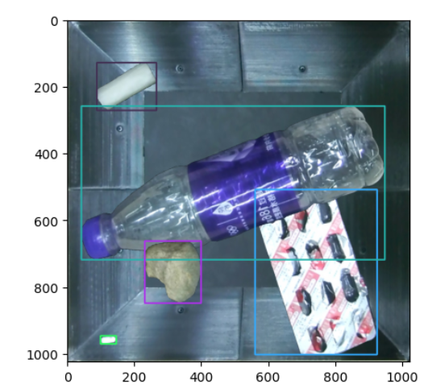

# Seg2DetAugment

 [](https://pypi.org/project/Seg2DetAugment/) [](https://opensource.org/licenses/MIT) [](https://github.com/Huuuuugh/Seg2DetAugment/actions)

中文 ｜  [English ](https://github.com/Huuuuugh/Seg2DetAugment/blob/main/README.md)



### 概述

Seg2DetAugment 是一个 Python 包，用于将语义分割数据转换为目标检测数据，并提供高级数据增强功能。该工具通过旋转、背景替换等操作，生成具有旋转不变性和复杂背景适应性的检测数据集，有效提升模型在复杂场景下的鲁棒性。

在进行目标检测任务时，背景通常会成为影响我们识别的准确性，例如，模型有时候会把背景识别成 某件物体、两个物体相互遮挡掉一部分而识别错误等，并且**卷积神经神经网络的旋转适应性有局限，缺乏显式的旋转不变性机制**，也就是说，在物体出现旋转的摆放情况下，通常会变得难以识别、置信度低下等问题，如果你试过市面上的旋转增强方法，你会发现它们都会有bbox莫名其妙变大的bug，这个是无法避免的，只有已知物体轮廓的情况下旋转才能保证bbox仍然是外接矩形，因此需要提出一种数据集增强的方法，向模型提供一个物体在不同背景下的表现情况，以及物体在不同旋转角情况下的状态。

### 核心优势

1. **旋转不变性增强**：通过轮廓追踪技术保持旋转后边界框的精准性
2. **复杂背景适配**：支持动态背景替换和多物体叠加
3. **标注效率提升**：只需少量语义分割标注即可生成大规模检测数据集

### 典型应用场景

- 工业质检中的多角度物体检测
- 垃圾分类场景的复杂背景适应
- 遥感图像的多姿态目标识别

### 安装方法

```bash
pip install Seg2DetAugment
```

## 数据集制作

安装anylabeling

```
conda create -n anylabeling python=3.10 anaconda
conda activate anylabeling
```

CPU：

```
pip install anylabeling
```

GPU:

```
pip install anylabeling-gpu
```

安装完毕后使用指令运行

```
anylabeling
```

在你下次需要执行的时候，你只需要这样做

```
conda activate anylabeling
anylabeling
```

准备好你要标注的图片文件夹，点击这里选择你的图片文件夹


然后点击这个大脑，开启SAM标注


选择一个你想要的模型，模型是自动从Huggingface下载的，如果失败，你可以使用我的网盘下载，我提供了sam2_hiera的tiny、small、base+三种规模的模型，对应的就是软件中的前三个模型，后面几个模型规模有点大我这边不提供下载，如果需要可以自行在Huggingface下载

通过网盘分享的文件：anylabeling模型
链接: https://pan.baidu.com/s/1c9CN3MkAUyAHa6p_zL7zRw?pwd=2dw5 提取码: 2dw5
模型下载好后，放入C:/Users/你的用户名/anylabeling_data/models中即可。


然后点+Point按钮，点击物体即可


没问题就点击finish，如果有问题，可以用-Point在误标记的地方点击，它会自动重新计算。

写入你希望的名称，同一个物体的名称必须相同


完成所有标记后，请你所有标签和图片将会存放在同一个文件夹内，像我这样子


然后，像我这样准备几张空白的背景图，背景图请尽可能制造一些差异。


### 快速开始

```python
from Seg2DetAugment import data_augmentation

# 定义类别映射
dics = {
    'battery': 0,
    'bottle': 1,
    # ... 其他类别
}

# 运行数据增强
data_augmentation(
    dics=dics,
    output_folder="output",
    path2labels="path/to/labels",
    path2imgs="path/to/images",
    path2bkgs="path/to/backgrounds",
    counts=3,        # 每张图像对象数量
    threshold=0.5,   # 重叠阈值
    num_images=100   # 生成图像总数
)
```

### 输出结构

```plaintext
output/
├── label/
│   ├── 0.txt
│   └── ...
└── img/
    ├── 0.jpg
    └── ...
```

### 参数说明

| 参数名          | 描述               | 默认值 |
| --------------- | ------------------ | ------ |
| `dics`          | 类别标签映射       | 必需   |
| `output_folder` | 输出目录路径       | 必需   |
| `path2labels`   | 输入分割标签路径   | 必需   |
| `path2imgs`     | 输入原图路径       | 必需   |
| `path2bkgs`     | 背景图像路径       | 必需   |
| `counts`        | 单图最大物体数     | 3      |
| `threshold`     | 重叠检测阈值 (IOU) | 0.5    |
| `num_images`    | 生成图像总数       | 100    |

### threshold详解

下面是一个例子，用于解释threshold的作用



如图，紫色框内实际上是一个萝卜条，但是被矿泉水瓶和芬达瓶子100%遮挡了，如果把这个数据集送去给目标检测模型进行训练，后果将不堪设想，因此，`threshold`的作用是为了保证物品之间至少有50%的区域是可见的。也就是说，允许遮挡，但最大只能遮50%，而不是100%

令`threshold`=你想要的遮挡率。例如`threshold=0.5`，生成的结果就变得令人愉快了。



### 许可证/Licence

本项目采用 MIT 许可证 开源。

